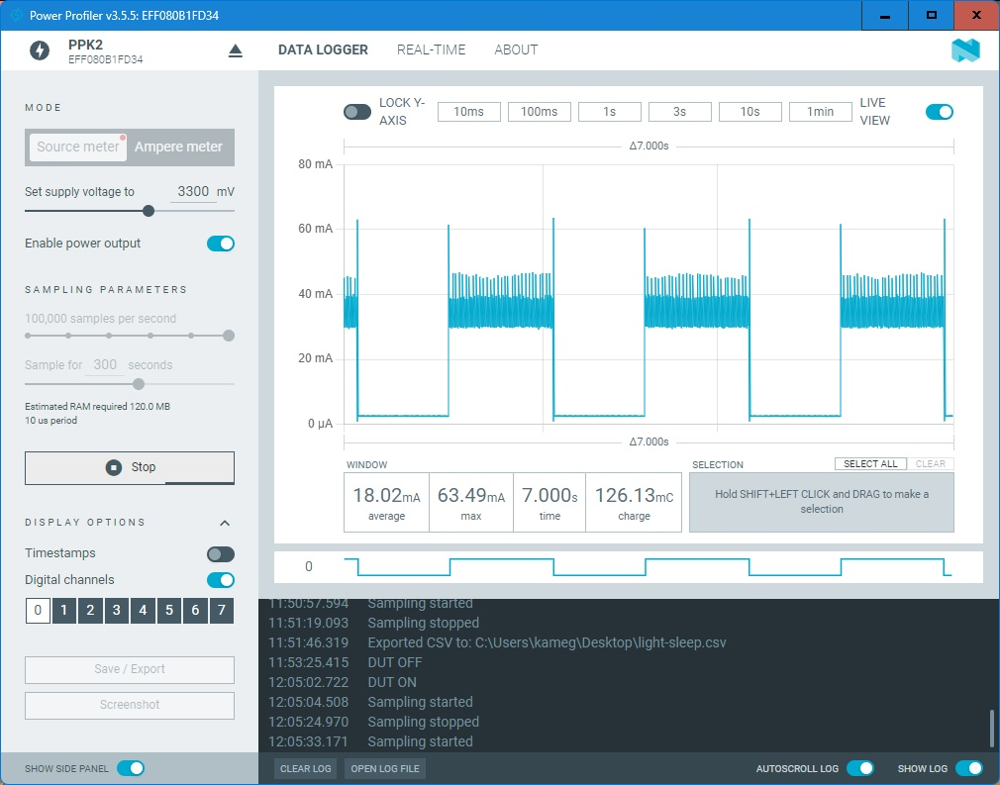

# Evaluation 1
## About Raw Result
The each file of raw result is approx. 800MB.  
Please post an issue if you want.

## Environments
 * Evaluation Board: ESP32-DevKitC-1 N8, v1.0
 * SDK: ESP-IDF v5.1.0
 * Ammeter: Nordic Power Profiler Kit II


## Method
### Program for Microcontroller Preparation
#### No-sleep
In `programs` directory,
```bash
$ mv main_no-sleep main
$ idf.py flash
```

#### Light-sleep
Make sure that the following line is in Line 92 of `programs/main_light-sleep_and_deep-sleep/main.c`,
```c
#if 1
```

and then, in `programs` directory,
```bash
$ mv main_light-sleep_and_deep-sleep
$ idf.py flash
```

#### Deep-sleep
Make sure that the following line is in Line 92 of `programs/main_light-sleep_and_deep-sleep/main.c`,
```c
#if 0
```

and then, in `programs` directory,
```bash
$ mv main_light-sleep_and_deep-sleep
$ idf.py flash
```

### Power Profiler Kit II Configuration 


* Source meter mode
* Supply voltage: 3.3V
* Sampling paramter : 10^5 samples per second for 300 seconds
* Enabled Digital Channel 0.

### Measurement
After the evaluation board powered on, the Theremin automatically starts to work.  

### Charts Output
`csv-cut.pl` is a program for cutting the raw result.  
`csv-cut.pl < no-sleep.raw.csv > no-sleep.csv` outputs `no-sleep.csv` by input `no-sleep.raw.csv`.
`script.m` (Works with MatLab or GNU Octave) draws the figures.

### Maximum, Minimum, Average
`get-statistics.f90` is a program that calculates the all data.  
Usage: `./a.out < no-sleep.csv`  
`get-statistics-percentile.c` is a program that calculates 10th-90th percentile of the data.  
Usage: `./a.out no-sleep.csv`  

