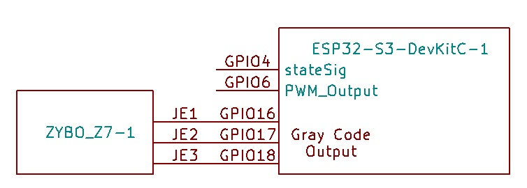
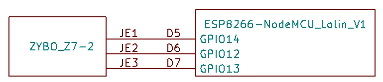

# Evaluation 2

## Environment
* Evaluation Board: ESP32-DevKitC-1 N8, v1.0
* SDK: ESP-IDF v5.1.0
* FPGA: Digilent ZYBO Z7-20
* EDA: AMD XILINX Vivado 2023.1 on Windows 11

### Connection
Please properly connect GNDs.


## Method

### Preparing the Hardware on The FPGA
The project file on `fpga/hardware/apris2023_measure/apris2023_measure.xpr`.

### Preparing the Program Running on The Microcontroller
In `programs` directory,
```sh
$ idf.py flash
```
The Theremin automatically starts to work.

If you want to change to Deep-sleep from Light-sleep, in Line 103 of `program/main/main.c`:
```c
#if 1
```

### Preparing the Program Running on The FPGA
Compile `fpga/processing_system_program/main.c` with a C compiler.  
Execute the binary with no arguments.

## Result & How to observe

The results are available as `Light-sleep.csv` and `Deep-sleep.csv`.

* 1st column: Elapsed time on iterations on the main processor until a state transition
* 2nd column: Data Transfer: main -> ULP
* 3rd column: ULP processor wake-up time
* 4th column: Elapsed time on iterations on the ULP processor until a state transition
* 5th column: Main processor wake-up time
* 6th column: Data Transfer: ULP -> main
* 7th column: garbage
* 8th column: garbage

`get_avg.sh` calculates averages of 2nd, 3rd, 5th, and 6th columns.

## Test program for FPGA
### Requirement
* ESP8266 board(Node MCU Lolin V3)

### Connection
Please properly connect GNDs.



### Preparing The Program Running on The ESP8266 Board
The project is on `fpga/tester`. Build by `idf.py build`.

### Expected Output
The expected output is:
```
1xx, 4xx, 2xx, 8xx, 5xx, 3xx, 7xx, 9xx
```

`xx` means an error.
